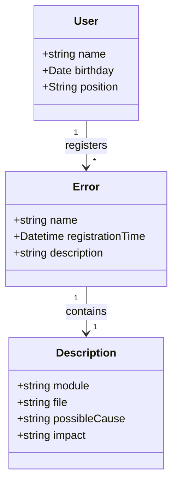

# Decola Tech 2025 - API para monitoramento de erros

API RESTful Java de monitoramento de erros.

## Principais Tecnologias
 - **Java 17**
 - **Spring Boot 3**
 - **Spring Data JPA**
 - **OpenAPI (Swagger)** 
 - **Railway**

## Protótipo do Figma
## [https://www.figma.com/design/GAXimg7jp4fxzAJGQY14xq/Untitled?node-id=4-6&t=6EyLBvk6y07zf2uP-1](https://www.figma.com/design/GAXimg7jp4fxzAJGQY14xq/Untitled?node-id=4-6&t=6EyLBvk6y07zf2uP-1)

## Diagrama de Classes

## Documentação da API (Swagger)

## [https://decola-tech-dio-api-production.up.railway.app/swagger-ui.html](https://decola-tech-dio-api-production.up.railway.app/swagger-ui.html)

